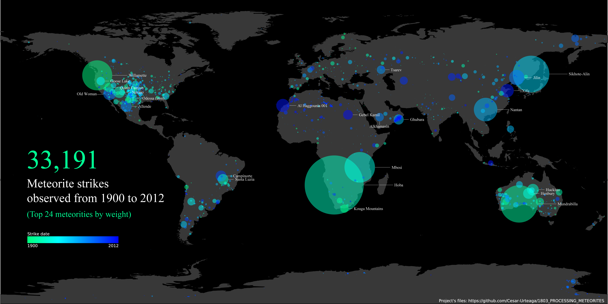

<!--
  Author            : Cesar R. Urteaga-Reyesvera.
  Creation date     : March 29, 2018.
-->

# Visualization of meteorites

## Table of Contents

* [Overview](#overview)
* [Organization of the project's files](#organization-of-the-projects-files)
* [Workflow](#workflow)

## Overview

This is my project for the [Designing Data Visualizations: Getting Started with Processing](https://www.skillshare.com/classes/Designing-Data-Visualizations-Getting-Started-with-Processing/1063775924) course offered by the [Skillshare platform](https://www.skillshare.com/) and taught by [Nicholas Felton](http://feltron.com/info.html).

The aim of this task is to process and visualize a meteorite database through [Processing](https://processing.org/).  The project's output is a Processing's image where the final details were carried out using [Adobe Illustrator](https://www.adobe.com/products/illustrator.html).

The figure below was the final output:

## Organization of the project's files

The above undertaking has the following structure:
  * **_CODES**: Contains the [Processing code](./_CODES/_FINAL/meteorSketch/meteorSketch.pde) that makes the meteorite visualization.
  * **_DATA**:  Has the raw data as well as the [world map SVG file](./_DATA/_RAW/WorldMap.svg) in which the data was rendered.  N.B.: The data was provided in the course.
  * **_GRAPHS**: Comprehends the Processing's output image and the final files that were created on Illustrator.
  * **_RESOURCES**: Include some relevant files that were used during the construction of the project.  In particular, it contains the [color wheel](./_RESOURCES/ColorWheelByDegree.png) that I used as guideline to choose the colors.
## Workflow

In order to create the final image, the following steps were performed:

1. First of all, I had gone over the data before I carried out any kind of processing.  I noticed that it was already sorted by weight; therefore, I did not worry about order the information provided.
2. Afterward, I set the layout up of the Processing's program (i.e., libraries, global variables, constants, setup, and drawing sections).
3. Soon thereafter, I coded and executed the visualization program; its output was a [pdf file](./_GRAPHS/_FINAL/MeteorStrikes.pdf).
4. Finally, using Illustrator, I changed manifold traits of the pdf file (e.g., background, color map, label arrangement, etc.).  I saved the [Illustrator project](./_GRAPHS/_FINAL/MeteorStrikesFinal.ai) and the [final pdf file](./_GRAPHS/_FINAL/MeteorStrikesFinal.pdf).
